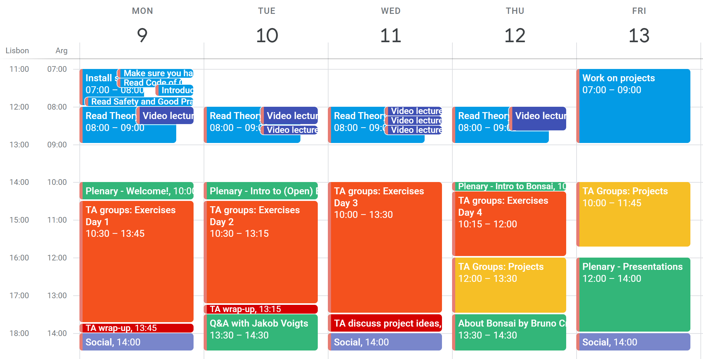

.. _refeeadocsindex:

*******************************
EEA Course Documents
*******************************

Course schedule for October 2023
############################

**Individual sessions** in blue are activities you do by yourselves prior to each daily group session. The times are just for guidance: you might take more or less time going through the material. You might do it a day earlier due to timezone differences, but we will expect you to have that material covered by the time you get to the day’s group session.

**Group sessions** are activities we do as a group. *You have to keep to this schedule regardless of your timezone*.
- Green and purple are events in which everyone is together in one Zoom room. Green are mandatory course events, purple are optional opportunities to spend time together.
- Orange and yellow are events in which you are divided into groups with your TA, each in their own group virtual space.

Materials for students
############################

Read the 'theory' documents and other assigned reading materials carefully before the start of each session. The 'exercises' documents contain exercises and more theory that will be covered together with the teachers. They do contain a lot of text, so reading through the exercises in advance may help you feel more prepared for the session.

To Do before Day 1
=====================================================

1. Check :ref:`Hardware requirements <refkitlist>`: install batteries in multimeter and check PC requirements and kit contents
2. Install :ref:`Software <refeeasoftware>`
3. Join the `Discord server <https://discord.gg/2F57u8jy44>`_, read the rules and introduce yourself
4. Check the schedule above in your timezone. You have to be available at group sessions
5. Read :ref:`Safety & Good Practices <refeeasafety>` 
6. Read :ref:`Theory Day 1 <refTDay1>` including the video lecture on Electrophysiology Acquisition
7. (Optional) Read `How to use a breadboard <https://learn.sparkfun.com/tutorials/how-to-use-a-breadboard/all#anatomy-of-a-breadboard>`_

Day 1: Detecting Signals
=====================================================

.. toctree::
  :maxdepth: 2

  theoryday1.rst

.. toctree::
  :maxdepth: 2

  exday1.rst

Day 2: Protecting and Amplifying Signals
=====================================================

.. toctree::
  :maxdepth: 2

  theoryday2.rst

.. toctree::
  :maxdepth: 2

  exday2.rst

Day 3: Referencing and Grounding
=====================================================

.. toctree::
  :maxdepth: 2

  theoryday3.rst

.. toctree::
  :maxdepth: 2

  exday3.rst

Day 4: Synchronization and Digitization
=====================================================

.. toctree::
  :maxdepth: 2

  theoryday4.rst

.. toctree::
  :maxdepth: 2

  exday4.rst
  projects.rst

No Hardware kit? Use these links!
*********************************************

.. toctree::
  :maxdepth: 1

  exday1_nokit.rst
  exday2_nokit.rst