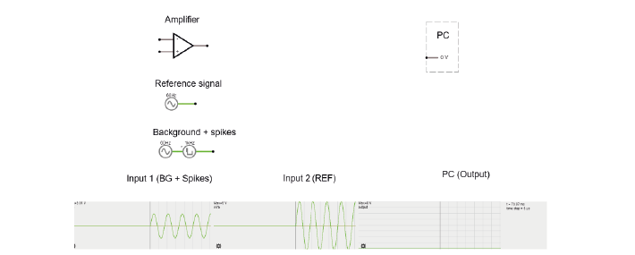
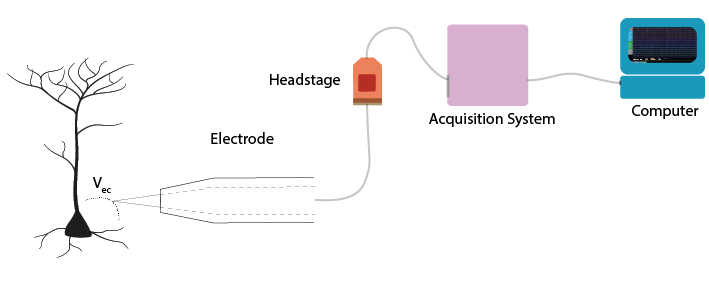
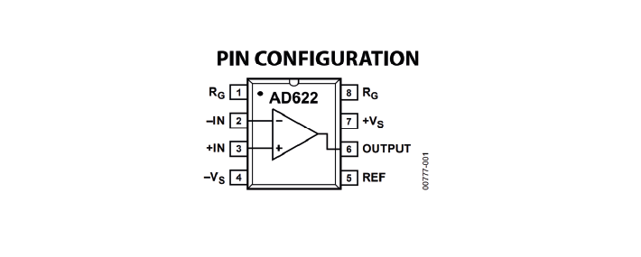
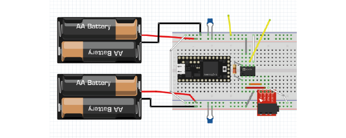
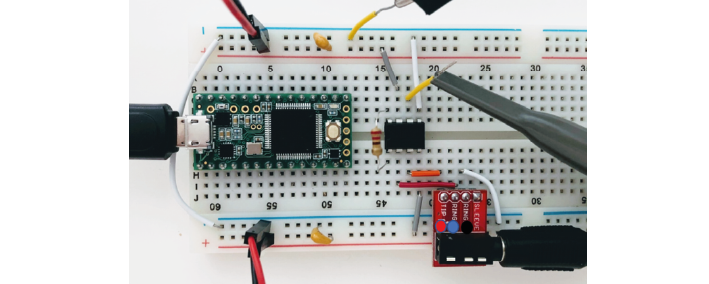

.. _refEDay3TA:

***********************************
Exercises Day 3 TA
***********************************

Differential Signals
###################################

.. toctree::
  :hidden:

  ampvoltagediv.rst
  soldiffamp.rst
  finaldiffamp.rst

A.	Measure across your fingers with the oscilloscope 1x probe. How big is the amplitude of this signal? Compare this to the size of a spike, around 100 µV.  Could you see a spike on top of that noise?

So far, we have only considered the signal coming into our recording electrode, relative to ground. We will now add a reference electrode in the simulator.

You can think of the small square waves as spikes you are trying to detect, and the sine wave (that both reference and your measurement electrode share) as background- maybe slow EEG signals or 50Hz noise, which is likely to be present at both electrodes.

Step-by-step, we are going to build our 'goal' circuit has the following properties:

- Input from the measurement electrode (spikes)
- Input from the reference electrode (common noise)
- Output: Reference subtracted from measurement, multiplied by gain
- Does not draw current from cells

Reference

Reference electrode
***********************************

A. Connect the reference and spike signal directly to the op-amp in open-loop configuration to subtract the reference. Connect the output of the amplifier to the PC. Run the simulation. What (in V) is the amplifier giving as output?

.. note::
  https://tinyurl.com/yemp5rve

B. Try adding a negative feedback connection to stop the amplifier from saturating.
Why does this not work unless you include a resistor?

C. Using two resistors on each side of the '-' input, make a voltage divider.
What is the output now? Can you change the gain?

.. note::
  https://tinyurl.com/yzz5ht4f

D. We're still not outputting our spikes. What went wrong?
Try to figure this out but don't get stuck forever.

.. note::
  https://tinyurl.com/yg63xmm5
  put '+' in middle of voltage divider to ground. yay this is a diff amplifier!

So, can we use this shiny new differential amplifier to record neural signals? We worked so hard to avoid drawing current from our frail electrode signal, and now we’re telling you to put big voltage dividers right at the inputs of our op-amp? That seems bad. Also, as we’ve just simulated, often op-amps do not have equal input impedances across + and -! This is similar to the example form earlier where we modelled a long wire, except that now you have two wires of different lengths in front of your inputs. If you've every measured electrode impedance, how much variation was there between electrodes? To get this differential amplifier to work, each electrode and resistor would have to be identical, which is, in practice, impossible.

E. How can we preserve the nice differential properties of the amplifier we just built, but still have our signals go straight into like a ‘+’ terminal on an op-amp to avoid impedance imbalances, and to avoid drawing current through voltage dividers? Extra hint: op-amps are cheap.

.. note::
  Solution: use 3 op-amps. 2 act as buffers for the reference and measurement electrode, the third amplifies the difference between them. https://tinyurl.com/ygzm5pg4

EMG circuit
*************************************
Now we are going to build an EMG circuit! We'll use the electrodes in your kit, an instrumentation amplifier as our headstage, and the Teensy will be our acquisition board. We now have all the steps of the acquisition in place to simulate a lab experiment.

Electrodes
###################################
.. warning::

  Your kit contains surface electrodes that we will use for EMG. These measurements involve attaching yourself to a circuit, so follow these rules to be safe:

  A.	Do not use anything other than the recommended batteries to power your circuit. Do not connect your circuit to mains supply for power, ground, anything.
  B.	Only connect the EMG electrodes to one arm. Don’t attach them to both arms. This is to avoid any current travelling across your heart.
  C.	If you are using a laptop, disconnect your laptop charger & run from battery while the electrodes are attached to you. This is to prevent any surges from mains supply from backpropagating through your laptop, to you.

The electrodes clip onto the cable with three wires. We’ll be using an audio-to-breadboard jack to get the signal from the electrodes into the breadboard.

Instrumentation Amplifier
###################################

`This <https://www.analog.com/media/en/technical-documentation/data-sheets/AD622.pdf>`_ is the datasheet for the instrumentation amplifier in your kit.

EMG circuit
###################################
.. warning::
  The disposable electrodes in the kit are single-use, so do not attach them until you are sure your circuit is working and that you have the correct position (see below).

First, we’ll wire up our electrodes to our instrumentation amp and read out the result with our oscilloscope. Later, we'll add the Teensy.

1. Replicate the following circuit:

* Bypass capacitor = 104
* Resistor: 220 Ohm

2. Now click the surface electrodes onto the ends of the cable, and click the jack into the breadboard adaptor.

* Black cable = ground electrode = Ring 1
* Blue cable = - (reference) electrode  = Ring 2
*	Red cable = + electrode = Tip

3. Attach your oscilloscope as shown:

If you tap the electrodes, you should see the trace of your PicoScope respond. If not, troubleshoot your circuit until you do.

.. note::
  Problems here are often:

  * Forgetting to connect both grounds
  * Being offset by 1 position in breadboard. Get the group to help each other spotting small errors like that.

3.	If your picoscope responds to tapping your electrodes, you are ready to measure EMG!
Place the measurement and reference electrode very close together, on the part of the forearm where you can feel your muscle when you tense it.  You should see a clear signal in the oscilloscope when you tense your muscles. Moving your arm will cause large motion artefacts (why?) so try to find a setup that gives you a consistent and clear signal.

4.	The resistor across the instrumentation amplifier sets the gain of the amplifier. Change the gain of the amplifier by changing Rg. What happens when the value for Rg is very low?

.. tip::
  If you have a lot of noise on your recording, try:

  •	Disconnecting from 60/50Hz contaminated ground by using laptop battery
  •	Try twisting or braiding the cables
