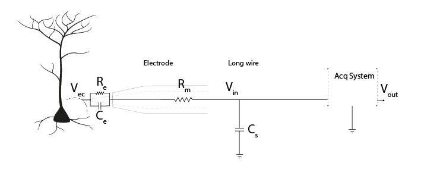
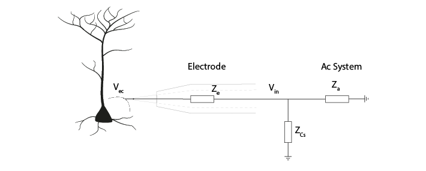
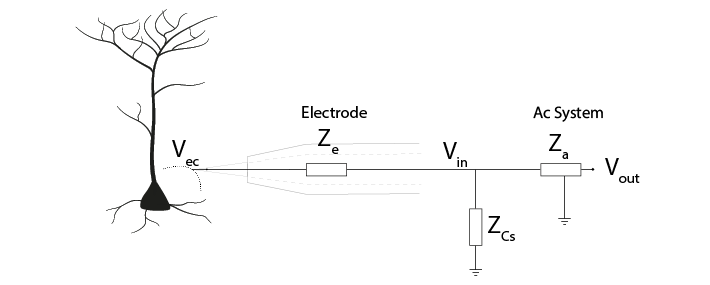
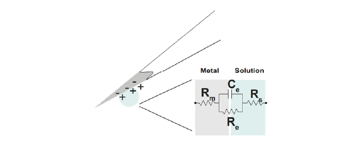
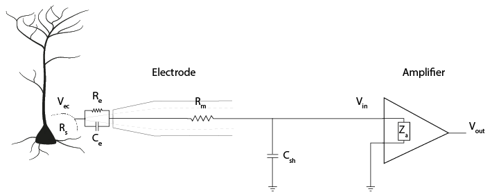
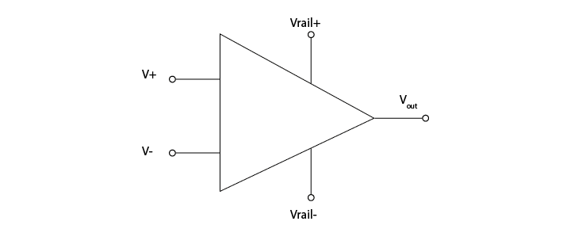
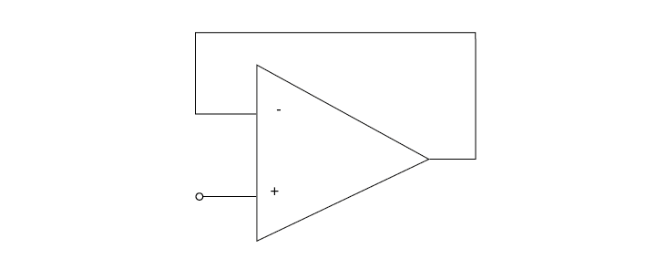
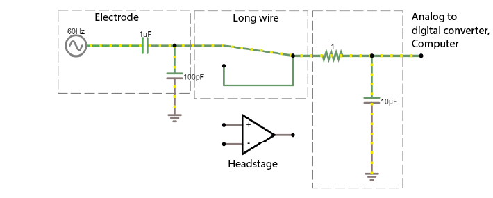

.. _refTDay2:

***********************************
Theory Day 2
***********************************

.. |Na+| replace:: Na\ :sup:`+`\
.. |Cl-| replace:: Cl\ :sup:`-`\
.. |Ca2+| replace:: Ca\ :sup:`2+`\
.. |K+| replace:: K\ :sup:`+`\
.. |Rs| replace:: R\ :sub:`s`\
.. |Rm| replace:: R\ :sub:`m`\
.. |Re| replace:: R\ :sub:`e`\
.. |Rsh| replace:: R\ :sub:`sh`\
.. |Ce| replace:: C\ :sub:`e`\
.. |Csh| replace:: C\ :sub:`sh`\
.. |Vin| replace:: V\ :sub:`in`\
.. |Vec| replace:: V\ :sub:`ec`\
.. |Vout| replace:: V\ :sub:`out`\
.. |Ve| replace:: V\ :sub:`e`\
.. |Za| replace:: Z\ :sub:`a`\
.. |Ze| replace:: Z\ :sub:`e`\

Yesterday, we said that an acquisition system must:
- *Detect* changes in electric potential difference
- Faithfully *transfer* this signal to our acquisition system output
- Distinguish interesting biological *signals* from other sources of electrical *noise*

Impedance ratios determine signal transmission
####################################################
Faithfully transferring the signal means not losing signal between |Vec|, |Vin|, and |Vout|. This is all based on the idea of voltage dividers; that the voltage between two impedances will be determined by determined by the ratio of their impedances.

Why is impedance important?
***********************************

.. raw:: html

  
<iframe width="560" height="340" src="https://www.youtube.com/embed/fVloDI4b1ts" title="YouTube video player" frameborder="0" allow="accelerometer; autoplay; clipboard-write; encrypted-media; gyroscope; picture-in-picture" allowfullscreen></iframe>

   

Currents coming from our neurons travel through our acquisition system, to ground. They can do so either by passing through our acquisition system, or (in parallel) they can be lost to ground through shunt capacitance (|Csh|).

We can just replace these components with a representation of the impedance (Z) they provide.

|Csh| and the acquisition system are parallel impedances. We can simplify our circuit by considering their combined impedance |Za|'.

This gives us a voltage divider, similar to the one we built before, where:

.. math::

  Vin = \frac{Za'}{Za'+Ze} Vec

Therefore, the ratio of |Ze| and |Za|' determines how much of our electrode tip voltage |Vec| reaches |Vin|. To get more of our voltage |Vec| into our recording system, we want to keep electrode impedance |Ze| low, and |Za|' very high.

To have no net current flowing, the shunt and amplifier impedance should be infinite. If |Za|’ is not substantially greater than |Ze|, |Vin| will be much lower than |Vec|. The best-case scenario is to have high |Za|’ and low |Ze|. To have low |Za|’, we need amplifiers with high input impedance and low shunt capacitance (high impedance).

Electrode Impedance
***********************************
The impedance of an electrode is a measure of its ability to resist the flow of charge across the electrode-solution interface (i.e., across the electronic conductor (metal) and ionic conductor (extracellular fluid)). It is the impedance of the whole electrode equivalent circuit we built yesterday, consisting of the resistance of the electrode metal (|Rm|) and the resistance (|Re|) and capacitance (|Ce|) of the double layer at the electrode-solution interface.

Since |Re| is large, in the order of several megaOhms, only very little current can take this route. Therefore, in practice, the electrode is primarily the double-layer capacitor |Ce| in series with |Rm| and |Rs| (Robinson, 1968).

So far, we know that the impedance magnitude of a capacitor decreases with increased capacitance, and that electrode impedance is dominated by double layer capacitor, |Ce|. Therefore, to decrease our electrode impedance, we need to increase the electrode capacitance |Ce|.
How can we increase the value of |Ce|?

.. math::

  C = \frac{\epsilon A}{d}

The capacitance of a capacitor, in Farads, is proportional to the area of the capacitor plates (A) divided by the distance (d) between them. ε is the electrostatic constant. To make C bigger, we can increase A by increasing the surface area of the electrode. This is done for instance by electroplating a thin layer of gold on to an electrode. We can also coat electrodes with materials complemented with pseudo-capacitance, such as conducting polymers or transition metal oxide films, such as IrOx (Green, Lovell, Wallace, & Poole-Warren, 2008; Musa, 2011). Electrode impedance magnitude is often measured at 1 kHz, before and after electrode coating, showing an impedance decrease up to 10-fold (Neto et al., 2018). By increasing the capacitance (|Ce|) of our electrode, the electrode impedance (|Ze|) will be smaller, preserving more of our signal amplitude at |Vin|.

Shunt Impedance
***********************************
Shunt impedance is the total impedance of shunt capacitance |Csh| and shunt resistance |Rsh|. At the high frequencies (1kHz) we are interested in, the capacitive component will usually have the largest effect because of its low impedance, so |Rsh| is often ignored. Shunt capacitance arises mainly from the capacitance across the thin insulation isolating an electrode shaft and the surrounding electrolyte, as well as the cumulative capacitance along cables and connectors (Robinson, 1968). Remember that any two conducting surfaces, with a non-conducting layer in between, *is* a capacitor.

The shunt capacitance for a tungsten wire (~50 to 100 pF) is usually higher than for a silicon probe (5-20 pF/cm). (Why? Think of what makes a capacitor, and the relative shape and conductances of these electrodes).

https://tinyurl.com/yepsdold

We want a large shunt impedance, to prevent current from flowing down this route. Being capacitive, the impedance decreases with signal frequency (Nelson et al., 2008). Therefore, to create a large shunt impedance, the shunt capacitance should be small:

.. math::
  Z = \frac{1}{2 \pi fC}

However, some shunt capacitance is inevitable and often there is not much we can do about it. Because the shunt impedance is in parallel with the impedance of the acquisition system, we can focus on increasing the acquisition system impedance to give us a large |Za|' and therefore a high |Vin|.

.. _refamplifierintro:

Amplifiers
#####################################################################

Amplifiers in the headstage prevent current being drawn
********************************************************************
A perfect 5V voltage source would always provide exactly 5 Volts, no matter what the rest of the circuit looks like. If we put a lot of high impedance components in the rest of the circuit, less current will flow, and if we put low impedance components we will get a high current.

A real voltage source has a bit of output impedance, which means it acts as a voltage source in series with an impedance. This is modelled here:

https://tinyurl.com/yfvzdxbz

That invisible, small series resistance creates a voltage divider. Though the actual source voltage is the same 5V, the apparent voltage of the source varies depending on the ratio between the output impedance of the source, and the impedance of the rest of the circuit. The lower the impedance of the components used in the rest of the circuit, the higher the relative influence of the source output impedance, and the lower the apparent source voltage.

In our acquisition system, the voltage source are the potential changes in the extracellular fluid (Vec). The resistive and capacitive properties of the electrode create an output resistance. The relative impedance of the circuit before and after Vin influence the magnitude of the signal at Vin. If we allow a lot of current to flow from our electrode to ground, we have a low impedance circuit, and will distort our signal. We therefore need something that will stop current being drawn from our cells, and provide the necessary current itself from a different source. This is done by amplifiers, in the headstage.

An 'operational amplifier' or 'op-amp' is a crucial building block of our acquisition system. The amplifier has two inputs (+ and -), one output, and two power rails (e.g. a 3 and -3V power rail).

Amplifiers have high input impedance
******************************************************************
The amplifier input impedance, Z\ :sub:`a`\  is its tendency to oppose the flow of current from the electrodes through the amplifier to ground. The input impedance of an amplifier is very high. This means that the circuit acts as though the current has to cross a very high resistor to actually enter the amplifier. By designing amplifiers with high input impedances, the current flow becomes low (Ferree et al., 2001), preventing us from drawing much current from the electrode to ground.

Here is the amplifier added into our circuit diagram:

Amplifiers have low output impedance
******************************************************************
The output impedance of amplifiers is very low, which means that a lot of current can flow. This current enables the driving of the signal through all the subsequent circuits (e.g., interconnect lines, multiplexer, and ADC). By placing an amplifier in our circuit, we make sure that the rest of our recording circuit is driven by current provided by the amplifier, not by current provided by the neurons.

Amplifiers output a voltage
*****************************************************************
The amplifier outputs the voltage difference between the voltages at its two inputs.

How does it do that? If the difference between its two inputs is positive, the amplifier connects its output to the positive ‘power rail’, giving a positive output voltage. If the positive power rail is 3V, the amplifier will output (pretty much) that. If the difference between the two inputs is negative, the amplifier will connect its output to the negative rail, outputting -3V. While doing that, the operational amplifier draws basically no current on its inputs.

In this configuration, the amplifier does not distinguish between small or large differences in voltage across its inputs; it will only every output the most negative or most positive voltage it can. Another way to say the same thing would be that it amplifies the difference between its input with a huge factor, also called ‘gain’.

If we connect the output of the operational amplifier to the ‘-’ input, then the following happens:

-	Initially, if '+' is higher than '-', the operational amplifier will output a high voltage.

-	If we connect the output back to ‘-’, the amplifier will continue to output a high voltage, but now this voltage starts to increase the value of '-', bringing the value of the inputs closer together. This behaviour will keep the voltages at its ‘+’ and ‘-’ inputs the same.

-	Now, *the ‘-’ input is always actively driven to follow the voltage on the ‘+’ input*. This means that whatever voltage we connect to the ‘+’ input can be measured just by looking at the ‘-’ input (which is connected to / the same as the output). Increasing '+' will induce a difference between ‘+’ and ‘-’, but the corresponding change in the amount of output voltage will bring '-' back up.

We can look at the voltage that is on ‘+’ by just measuring the output of the operational amplifier, BUT because the ‘+’ input draws almost no current at all (in other words, very high input impedance), we can now measure weak signals. The output of the operational amplifier on the other hand side has very low output impedance- in other words, we can draw a lot of current from it and it will keep its voltage. This is in contrast to our neurons, we don't want to draw a lot of current from them.

You can run this example in the simulator, and see if what we said above about the operational amplifier makes sense. You should see that the operational amplifier stops the cable from drawing current from the electrode, and that the operational amplifier instead manages to ‘drive’ the cable effortlessly, by providing a lot of current.

|

Our electrodes will be attached to a headstage, which contains an amplifier. This amplification step performs several functions:

-	Prevents us from drawing current and allows to drive current to ADC and computer
-	Rejects common mode noise
-	Increases the range of the signal to fit the dynamic range of our digitizer

.. raw:: html

  
<iframe width="560" height="340" src="https://www.youtube.com/embed/NP6nE5P82e8" title="YouTube video player" frameborder="0" allow="accelerometer; autoplay; clipboard-write; encrypted-media; gyroscope; picture-in-picture" allowfullscreen></iframe>

The path from our neuronal currents first crosses the electrode and then goes either through the amplifier to ground, or through shunting routes (|Csh| and |Rsh|) to ground. The amplifier has its own (very high) impedance |Za|.
