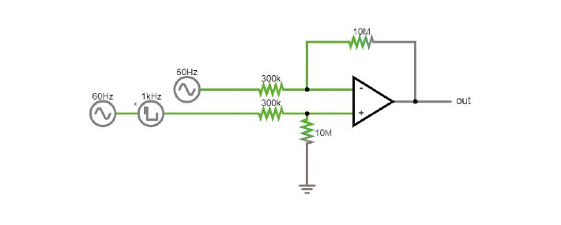
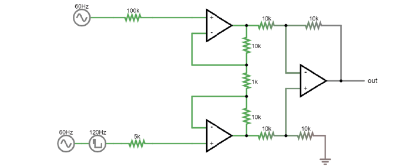

.. _refTDay3:

***********************************
Theory Day 3
***********************************

.. |Na+| replace:: Na\ :sup:`+`\
.. |Cl-| replace:: Cl\ :sup:`-`\
.. |Ca2+| replace:: Ca\ :sup:`2+`\
.. |K+| replace:: K\ :sup:`+`\
.. |Rs| replace:: R\ :sub:`s`\
.. |Rm| replace:: R\ :sub:`m`\
.. |Re| replace:: R\ :sub:`e`\
.. |Rsh| replace:: R\ :sub:`sh`\
.. |Ce| replace:: C\ :sub:`e`\
.. |Csh| replace:: C\ :sub:`sh`\
.. |Vin| replace:: V\ :sub:`in`\
.. |Vec| replace:: V\ :sub:`ec`\
.. |Vout| replace:: V\ :sub:`out`\
.. |Ve| replace:: V\ :sub:`e`\
.. |Za| replace:: Z\ :sub:`a`\
.. |Ze| replace:: Z\ :sub:`e`\

An acquisition system must therefore:
- *Detect* changes in electric potential difference
- Faithfully *transfer* this signal to our acquisition system output
- Distinguish interesting biological *signals* from other sources of electrical *noise*

Differential amplifiers remove common noise
#########################################################

Referencing
**************************************
We live in an (electrically) very noisy world. We always have to measure our signal as the difference between two points- one is our recording electrode. The other point is our reference, which can be another electrode in the brain or a screw in the animal’s skull. The choice you make here is very important for your recording: the amplifier will output the difference between your recording electrode and your reference point. That means that the amplifier will do its best to get rid of any signal that the two share. If the recording electrode picks up 50 Hz noise generated by the mains power supply in the walls, you want the amplifier to get rid of it, so it’s best to use a reference point that will also pick up this noise. However, if your reference is picking up signals that you are interested in, the amplifier will get rid of those too. To choose an appropriate reference, you have to decide what qualifies as noise in your experiment.

Differential Amplifiers
**************************************

.. raw:: html

  
<iframe width="560" height="340" src="https://www.youtube.com/embed/91SVSdoEFzU" title="YouTube video player" frameborder="0" allow="accelerometer; autoplay; clipboard-write; encrypted-media; gyroscope; picture-in-picture" allowfullscreen></iframe>

The amplification of the potential difference between the microelectrode and the reference electrode (in the order of microvolts) is a crucial step, and is accomplished with differential amplifiers that amplify the differences, rejecting the noise that is often introduced as common-mode potential in the circuit (i.e., noise identical in the recording and reference electrodes typically caused by motion artifacts and capacitive coupling of the body and electrode lead with power line fields (Nunez & Srinivasan, 2009)).

Instrumentation amplifiers
#########################################################

Talk
***********************************

.. raw:: html

   
  
<iframe width="560" height="340" src="https://www.youtube.com/embed/uPcv0gBjqbA" title="YouTube video player" frameborder="0" allow="accelerometer; autoplay; clipboard-write; encrypted-media; gyroscope; picture-in-picture" allowfullscreen></iframe>

   

Why do we need Instrumentation amps?
*************************************

Let's quickly revisit why we can't just use 1 operational amplifier to get a nice signal.

To make this circuit differential, we need voltage dividers. But, these are connecting our fragile signal to ground! Plus, remember how any mismatch in the input impedances between ‘+’ and ‘-’ messes up the signal if there is a lot of common mode noise? In practical terms, there is always going to be a mismatch between these resistors; they simply cannot be produced in a way that makes them exactly equal. Why? Because this resistor is *also your electrode*. If you work with electrodes, have you measured their impedances? How similar are they? If you made these resistors as different as your electrodes are variable, this circuit will not work to eliminate common mode noise and amplify our spikes.

The solution is to use *three* op-amps:

.. image:: ../_static/images/EEA/eea_fig-33.png
  :align: center
  :scale: 80

Here it is in the simulator:

Gain resistor:
The voltages on either side are fixed, because the op-amps are keeping them in place. Same V and lower R = more current must travel through the resistor, and therefore more current through the feedback resistors of the two buffer op-amps. Those are fixed resistors: higher I for same R is a higher voltage drop across these resistors. Both buffer op-amps now have to work harder to overcome this voltage drop and will output more extreme voltages. By decreasing the value of Rgain, we are basically making the inputs to the final op-amp more different to each other, and therefore increasing the gain of the instrumentation amp.  

Common mode rejection ratio (CMRR)
***********************************

When the input impedances of the differential amplifier weren’t matched, part of the input signal that was common to both inputs, and thus should be cancelled out, actually appeared in the output. A common way to model how well an amplifier subtracts one input to the other is the following:
We define each input (+ and -) to be a sum of an individual voltage (V1 or V2) plus a voltage common to both. In our arms, or the brain of an animal, this common voltage (Vc) could be electrical noise or muscle activity we are not interested in and want to discard. In this case, the inputs would be:

.. math::
  V+ = V1 + Vc
.. math::
  V- = V2 + Vc

(In our earlier examples of a differential amplifier, V2 was ground 0V, which is a perfectly valid value). In an **ideal** differential amplifier, the output should be the difference of both amplified by a factor:

.. math::
  Vout = Ad (V+ - V-)

.. math::
       = Ad ((V1+Vc)-(V2+Vc))

.. math::
       = Ad (V1-V2)

Where Ad is the differential gain, the factor by which the differential signal is amplified.
Here, the unwanted, common signals cancel out and only the signal we are interested in is amplified.

A **real** amplifier, however, acts in a different way. As we’ve seen, small imperfections can lead to part of the common voltages being amplified as well. In this case, the output of a real amplifier ends up being:

.. math::

  Vout = Ad (V1 - V2 ) + Ac * Vc

In addition to the differential gain, a new term  'Ac', or common gain, appears. This amplifies the signal common to both inputs. Of course, we want an amplifier to have a differential gain as high as possible and a common gain as low as possible (ideally, Ac would be 0). The relation between these two gains tells us how good an amplifier is at amplifying only the differential signals. This is called the Common Mode Rejection Ratio, or CMRR, simply defined as

.. math::
 CMRR = \frac{Ad}{Ac}

or

.. math::
 CMRR = 20log\frac{Ad}{Ac}

if measured in decibels.

The higher the CMRR, the better the amplifier is at cancelling out the signals common to both inputs.
Instrumentation amplifiers are not completely immune to common input noise. They are real circuits and, as such, there are multiple ways for these common signals to bleed out into the output. They have, however, a very high CMRR. Comparing the two devices we’ve been using, the operational amplifier LM358 has a CMRR of 80dB while the instrumentation amplifier has a CMRR of 120dB, 100 times higher! (Sounds underwhelming? Remember decibels are logarithmic; the difference between 80 and 120 dB in terms of sound is the difference between a toilet flushing and a jet engine).
