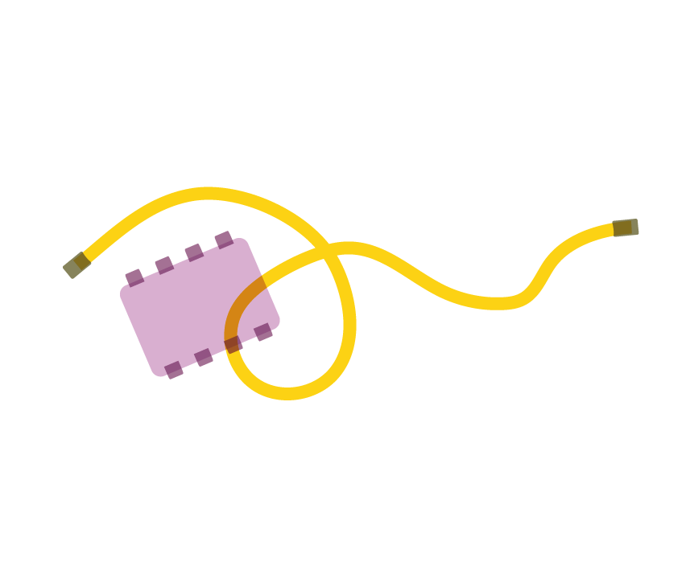
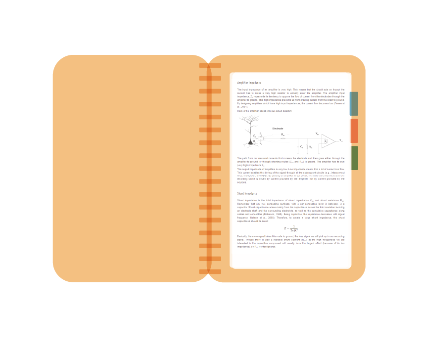

****************************************************************
Extracellular Electrophysiology Acquisition, Dec 2021
****************************************************************
.. _refeea:

.. toctree::
  :hidden:

  /Materials/kitlist.rst
  /Materials/eeadocsindex.rst
  /Materials/disclaimer_terms_conditions.rst
  /Materials/license.rst

These are the course materials for the Open Ephys course on Extracellular Electrophysiology Acquisition, December 2021 edition.

.. raw:: html

    

        

            

                

.. container:: custom-button

    :ref:`NeuroKit Equipment List <refkitlist>`

|

Equipment needed for the hands-on exercises

|

.. raw:: html

                

            

            

                

.. container:: custom-button

    :ref:`Reading Materials and Exercises <refeeadocsindex>`

Documents with theory and exercises per day

|

.. raw:: html

              

          

        

    

