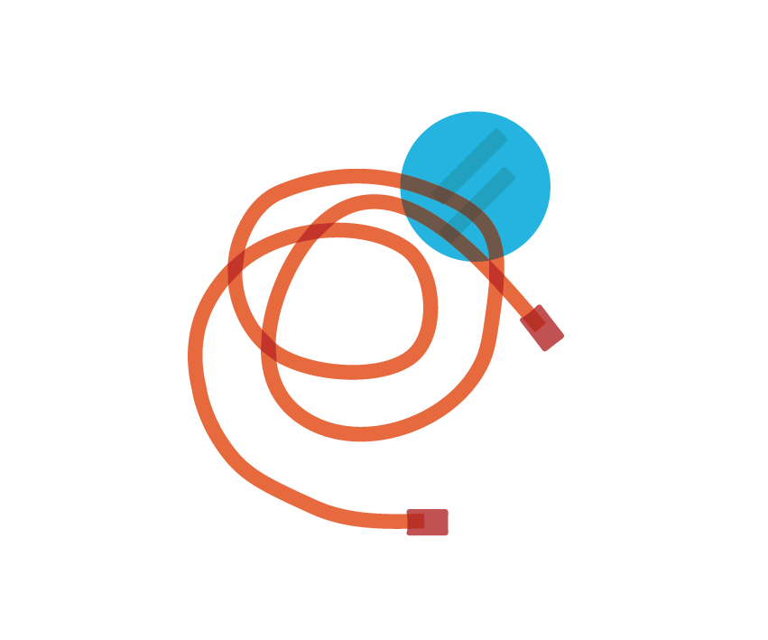

****************************************************************
Extracellular Electrophysiology Acquisition
****************************************************************
.. _refeea:

.. toctree::
  :hidden:

  /Materials/kitlist.rst
  /Materials/eeadocsindex.rst
  /Materials/disclaimer_terms_conditions.rst
  /Materials/license.rst
  /Materials/acknowledgements.rst

*December 2021*

These are the course materials for the Open Ephys course on Extracellular Electrophysiology Acquisition, December 2021 edition.

.. raw:: html

    

        

            

                

.. figure:: _static/images/EEA/eea_fig-85.png
  :target: Materials/kitlist.html

.. container:: custom-button

    :ref:`Kit Equipment List <refkitlist>`

.. raw:: html

                

            

            

                

.. container:: custom-button

    :ref:`Reading and Exercises <refeeadocsindex>`

.. raw:: html

              

          

          

          

          

              

.. container:: custom-button

    :ref:`Schedule <refschedule>`

.. raw:: html

        

    

    

    

.. container:: custom-button

    :ref:`Licensing <reflicense>`

.. raw:: html

                

            

          

        

        

